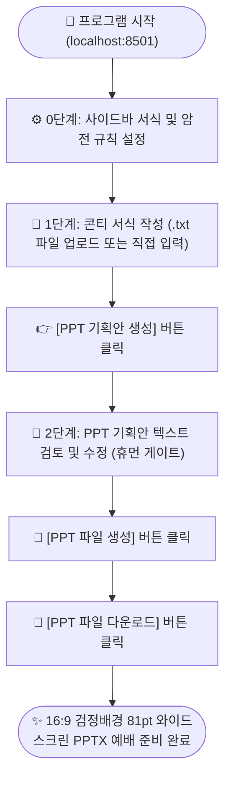

# 📖 Worship PPT Generator 공식 사용자 가이드 (User Manual)

> **교회 찬양팀을 위한 초고속 16:9 와이드스크린 찬양 PPT 자동 제작 프로그램**  
> 콘티 작성부터 슬라이드 기획안 검토, 100% 무결점 PPTX 다운로드까지의 사용자 흐름(User Flow)을 상세히 설명합니다.

---

## 🧭 1. 전체 사용자 흐름도 (Workflow)



---

## ⚙️ 2. 사전 준비: 사이드바 서식 및 암전 규칙 설정

화면 좌측 사이드바는 PPT의 전체적인 디자인 규격과 암전(`[BLANK]`) 동작 방식을 제어합니다.

```
[⚙️ PPT 디자인 및 서식 설정]
- 글꼴 (폰트): 프리젠테이션 Bold (권장), Pretendard, 나눔스퀘어 Bold, 맑은 고딕 등
- 글자 크기: 60pt ~ 96pt (기본 81pt 권장 - 대예배당/소예배실 최적 가독성)

[💡 슬라이드 암전 규칙]
- [v] 곡 제목 뒤 암전(전주/준비) 자동 삽입 (기본 체크)
- [v] 곡 종료 시 암전(곡 전환) 자동 삽입 (기본 체크)
```

> [!TIP]
> **암전 규칙 활용 팁**:
> 1. **곡 제목 뒤 암전**: 곡 제목 슬라이드가 나간 직후, 밴드가 전주(Intro)를 연주하는 동안 스크린을 검은 암전 화면으로 대기시킵니다.
> 2. **곡 종료 시 암전**: 한 곡의 찬양이 끝나고 다음 곡으로 넘어가기 전, 자연스러운 곡 전환을 위해 검은 암전 화면을 자동 삽입합니다.

---

## 📝 3. 1단계: 콘티 작성 및 업로드 (작성 규칙)

### 3-1. 콘티 입력 방식 (2가지)
1. **에디터에 직접 입력/붙여넣기**: 중앙 텍스트 영역에 카카오톡이나 메모장에 적힌 콘티를 그대로 붙여넣습니다.
2. **.txt 파일 업로드**: 사이드바의 **`[📁 콘티 파일 업로드]`** 창에 `.txt` 파일을 드래그하여 올리면 내용이 자동으로 채워집니다.

---

### 3-2. 콘티 필수 작성 문법

| 구분 | 작성 문법 | 예시 | 동작 결과 |
| :--- | :--- | :--- | :--- |
| **표지 정보** | `# [날짜] [모임명]` | `# 2026.09.06 LOGOS 청년 모임` | 1페이지 표지 슬라이드 자동 생성 |
| **대표기도자** | `기도: [이름]` | `기도: ㅇㅇㅇ 청년` | 찬양 종료 후 마지막 대표기도 슬라이드 자동 생성 |
| **곡 제목** | `## [곡 번호/제목]` | `## 1. 새 힘 얻으리` | 곡 시작 선언 및 제목 슬라이드(`[ 새 힘 얻으리 ]`) 생성 |
| **악보 루틴** | `루틴: [진행 순서]` | `루틴: Intro(8) - V - P - C...` | 악보 상단 순서에 맞추어 가사 슬라이드를 순방향 전개 |
| **파트 선언** | `[파트명]` | `[V]`, `[V2]`, `[P]`, `[C]`, `[B]` | 각 가사 블록의 시작을 선언 |
| **슬라이드 분할**| **더블 엔터(빈 줄)** | *(가사 사이 한 줄 띄움)* | **빈 줄 하나**가 들어가면 다음 슬라이드로 분할 |

---

## 📑 4. 2단계: PPT 기획안 텍스트 검토 및 수정 (휴먼 게이트)

1단계에서 **`[PPT 기획안 생성]`** 버튼을 클릭하면, 탭이 자동으로 **`2. PPT 기획안`**으로 전환되며 전체 슬라이드가 순서대로 전개됩니다.

```text
[1페이지] (표지)
[2026.09.06] LOGOS 청년 모임

[2페이지] (찬양 시작 전 암전)
[BLANK]

[3페이지] (새 힘 얻으리 제목)
[ 새 힘 얻으리 ]

[4페이지] (전주 암전)
[BLANK]

[5페이지] (새 힘 얻으리 - V)
새 힘 얻으리
주를 바랄 때
...
```

> [!NOTE]
> **휴먼 게이트(Human Gate)란?**  
> AI나 자동화 프로그램이 생성한 결과를 곧바로 파일로 내보내지 않고, 담당자가 메모장처럼 오탈자를 검수하고 필요한 위치에 `[BLANK]`(암전)를 넣거나 뺄 수 있도록 하는 안전 검증 단계입니다.

---

## 💾 5. 3단계: 최종 PPT 파일 생성 및 다운로드

1. 기획안 검토가 끝나면 하단의 **`[PPT 파일 생성]`** 버튼을 누릅니다.
2. 약 0.5초 만에 16:9 와이드스크린 양 끝 꽉 찬 텍스트 박스로 PPTX가 빌드됩니다.
3. 활성화된 **`[PPT 파일 다운로드]`** 파란색 버튼을 클릭하면 **`20260906 찬양 가사.pptx`** 파일이 즉시 저장됩니다.

---

## 🔍 6. 부록: 악보 루틴 표기법 완전 정복 가이드

실제 교회 악보에 적히는 다양한 기호들을 100% 인식합니다.

| 악보 표기 | 인식 분류 | 생성되는 슬라이드 |
| :--- | :--- | :--- |
| `Intro(8)`, `Intro`, `전주` | 도입 전주 | 전주 암전 옵션에 따라 `[BLANK]` 암전 슬라이드 생성 |
| `(1)`, `(2)`, `(4)`, `(8)` | 마디 수 간주 | **`[BLANK]` 암전 슬라이드 자동 생성** |
| `I(8)`, `ITL1(4)`, `간주`, `Solo` | Interlude 간주 | **`[BLANK]` 암전 슬라이드 자동 생성** |
| `(기도)`, `(멘트)`, `(묵상)` | 기도/멘트 | **`[BLANK]` 암전 슬라이드 자동 생성** |
| `Cx2`, `Bx4`, `Tag*2` | 반복 연주 | 해당 파트 가사 **2회 / 4회 연속 자동 전개** |
| `C(잔잔)`, `P(break)`, `(수아)V` | 연주/보컬 뉘앙스 | 수식어 무시하고 기본 `C`, `P`, `V` 파트 가사 자동 매칭 |
| `C'`, `C’` (Key-up) | 조바꿈 후렴 | 1차로 `[C']` 파트를 찾고, 없으면 기본 `[C]` 가사 자동 적용 |
| `Tag`, `[TAG]` | 태그 파트 | `[TAG]` 파트 우선 매칭, 없으면 **후렴(`[C]`)의 마지막 슬라이드 자동 적용** |
| `(나 기쁨의 춤추리)` | 특정 괄호 문장 | 별도 파트 없이 해당 문장으로 **자막 슬라이드 즉시 생성** |

---

## 📝 라이선스 & 제작
- **Worship PPT Generator v1.0.0** | Made by **@loose_lab**

